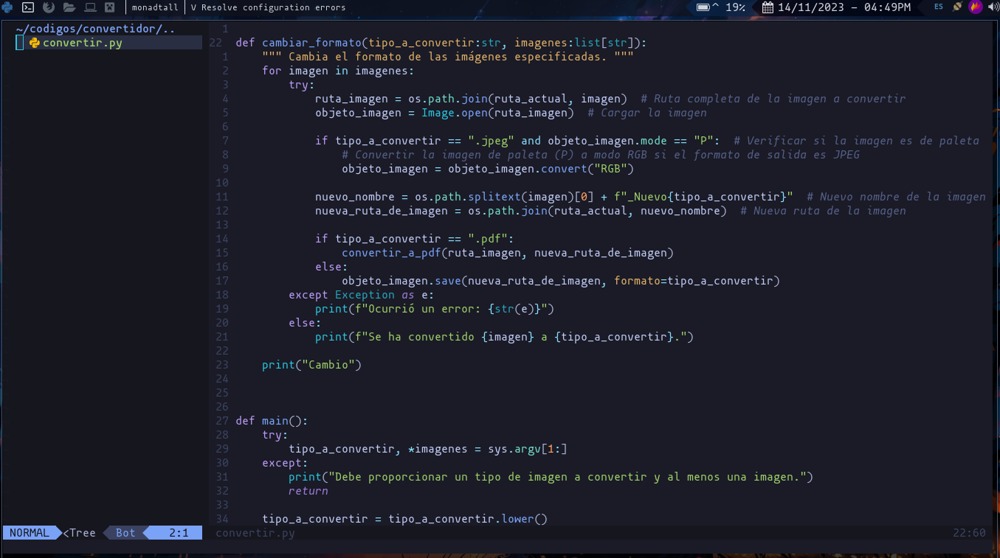
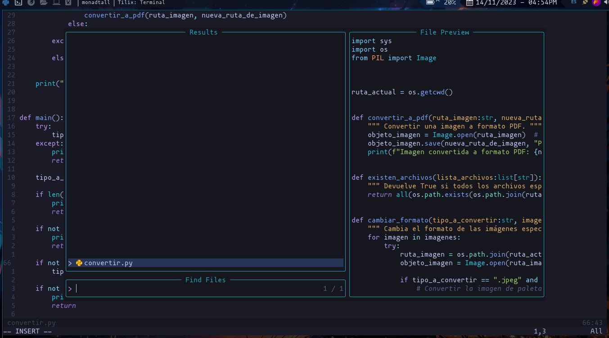
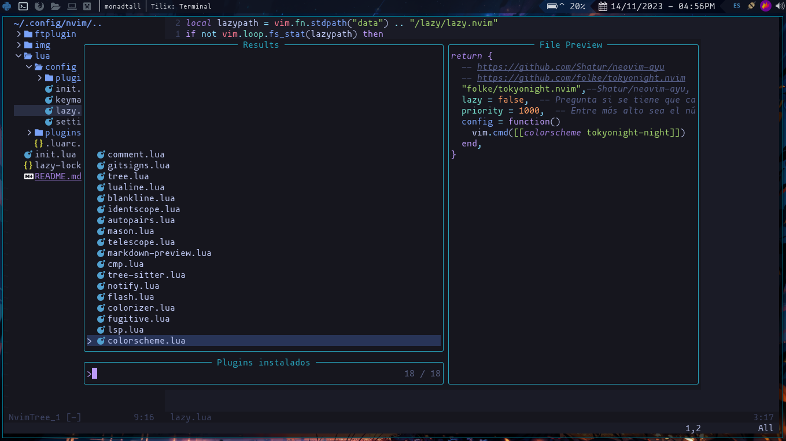

# ¿Cómo usar neovim con mis configuraciones?

## Requerimientos
Si estas usando Ubuntu, para que telescope funcione correctamente debes de instalar 3 dependencias que son:
````bash
sudo apt install build-essential
````

````bash
sudo apt install fd-find
````

````bash
sudo apt install ripgrep
````

## 

<br>

<br>

<br>

## Atajos de teclado
### < leader> es la tecla de espacio

| **Atajo**        | **Significado**           | **Descripción**                                                  |
|:----------------:|:-------------------------:|:----------------------------------------------------------------:|
| **jj**           | \<esc\>                   | Mapea jj como escape                                             |
| **\<leader>w**   | :w                        | Guarda el archivo actual                                         |
| **\<leader>q**   | :q                        | Cierra el archivo actual                                         |
| **\<leader>i**   |                           | Inserta ";" al final de una línea da un salto de línea           |
| **\<leader>o**   |                           | Inserta "{" al final de la línea y da un salto de línea          |
| **\<C-b\>**      | :NvimTreeToggle           | Muestra/oculta el árbol de archivos                              |
| **\<leader>r**   | :RunCode                  | Ejecuta el código que haya en el archvio                         |
| **\<leader>cf**  |                           | Formatea el código que haya en el archivo                        |
|                  | Atajos de telescope       |                                                                  |
| **\<leader>ff**  | find files                | Muestra archivos en el directorio actual                         |
| **\<leader>fp**  | find plugins              | Muestra la ruta de los plugins instalados                        |
| **\<leader>fb**  | find buffers              | Muestra los buffers abiertos                                     |
| **\<leader>fg**  | find git files            | Muestra los archivos git                                         |
| **\<leader>ft**  | find tags                 | Muestra las etiquetas                                            |
| **\<leader>fs**  | file browser              | Muestra el file browser de telescope                             |
| **\<leader>gs**  | git status                | Muestra el estatus de los archivos                               |
| **\<leader>gcs** | git commits               | Muestra los commits realizados                                   |
| **\<leader>gb**  | git branch                | Muestra las ramas del proyecto                                   |
|                  | Atajos de fugitive        |                                                                  |
| **\<leader>gi**  | git init                  | Inicializa un nuevo repositorio                                  |
| **\<leader>gr**  | git remote                | Agrega un repositorio remoto                                     |
| **\<leader>gl**  | git log                   | Muestra los logs del repositorio                                 |
|                  | Atajos básicos de comment |                                                                  |
| **gc**           |                           | Comenta líneas seleccionadas                                     |
| **gcc**          |                           | Comenta la línea sobre la que está el cursor                     |
| **gb**           |                           | Comenta en bloque las líneas seleccionadas                       |
|                  | Atajos de tree-sitter     |                                                                  |
| **af**           | En modo visual            | Selecciona el contenido de una función y la misma función        |
| **if**           | En modo visual            | Selecciona el contenido de una función                           |
| **ac**           | En modo visual            | Selecciona el contenido de un condicional y el mismo condicional |
| **ic**           | En modo visual            | Selecciona el contenido de un condicional                        |
| **al**           | En modo visual            | Selecciona el contenido de un bucle y el mismo bucle             |
| **il**           | En modo visual            | Selecciona el contenido de un bucle                              |
