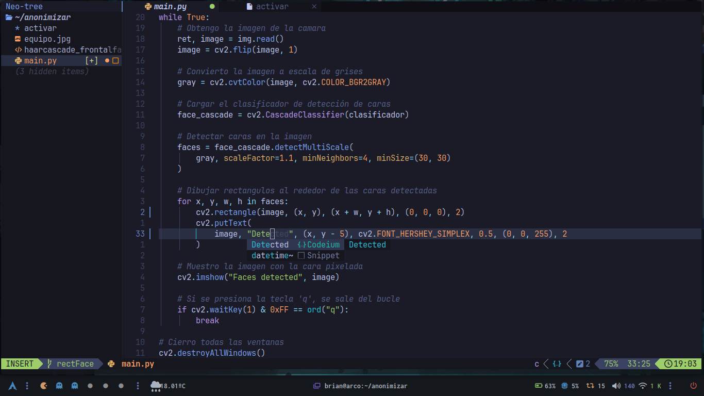
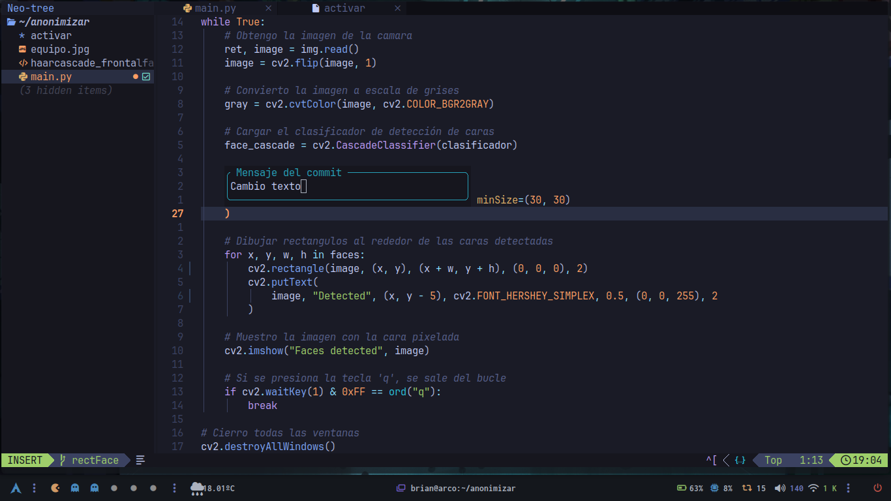
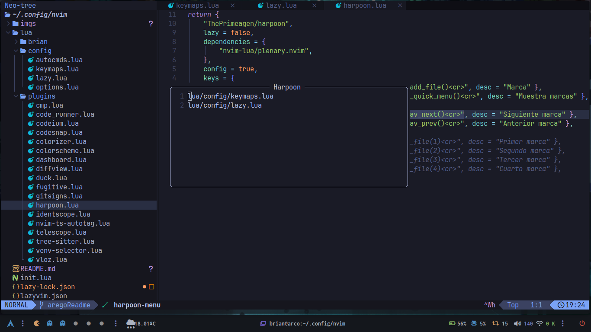

# Configuraciones de neovim

## Vistas

<table>
    <tr>
        <td>
            
        </td>
        <td>
            
        </td>
    </tr>
    <tr>
        <td>
            
        </td>
        <td>
            
        </td>
    </tr>
</table>

## Atajos de teclado

### < leader> es la tecla de espacio

| **Atajo**        | **Significado**           | **Descripción**                                                  |
|:----------------:|:-------------------------:|:----------------------------------------------------------------:|
| **jj**           | \<esc\>                   | Mapea jj como escape                                             |
| **\<leader>w**   | :w                        | Guarda el archivo actual                                         |
| **\<leader>q**   | :q                        | Cierra el archivo actual                                         |
| **\<C-b\>**      | :Neotree toggle           | Muestra/oculta el árbol de archivos                              |
| **\<C-w\>**      | :BufferLinePickClose      | Muestra la opción de cerrar un archivo                           |
| **\<C-tab\>**    | :BufferLineCycleNext      | Muestra la opción de cerrar un archivo                           |
| **\<C-S-tab\>**  | :BufferLineCyclePrev      | Muestra la opción de cerrar un archivo                           |
| **\<leader>r**   | :RunCode                  | Ejecuta el código que haya en el archvio                         |
| **\<leader>cf**  |                           | Formatea el código que haya en el archivo                        |
|                  | Atajos de telescope       |                                                                  |
| **\<leader>ff**  | find files                | Muestra archivos en el directorio actual                         |
| **\<leader>fp**  | find plugins              | Muestra la ruta de los plugins instalados                        |
| **\<leader>fb**  | find buffers              | Muestra los buffers abiertos                                     |
| **\<leader>fg**  | find git files            | Muestra los archivos git                                         |
| **\<leader>ft**  | find tags                 | Muestra las etiquetas                                            |
| **\<leader>gs**  | git status                | Muestra el estatus de los archivos                               |
| **\<leader>gb**  | git branch                | Muestra las ramas del proyecto                                   |
|                  | Atajos de fugitive        |                                                                  |
| **\<leader>gi**  | git init                  | Inicializa un nuevo repositorio                                  |
| **\<leader>ga**  | git add .                 | Agrega los cambios al repositorio                                |
| **\<leader>gc**  | git commit -m             | Crea un commit con su mensaje                                    |
| **\<leader>gr**  | git remote add origin     | Agrega un repositorio remoto pidiendo su URL                     |
|                  | Harpoon                   |                                                                  |
| **\<leader>a**   | require('harpoon.mark').add_file()     | Agrega una marca de harpoon a un archivo            |
| **\<C-e>**       | require('harpoon.ui').toggle_quick_menu()     | Muestra los harpoons activos                 |
| **\<leader>hn**       | require('harpoon.ui').nav_next()     | Va al siguiente harpoon                          |
| **\<leader>hp**       | require('harpoon.ui').nav_prev()     | Va al harpoon anterior                           |
